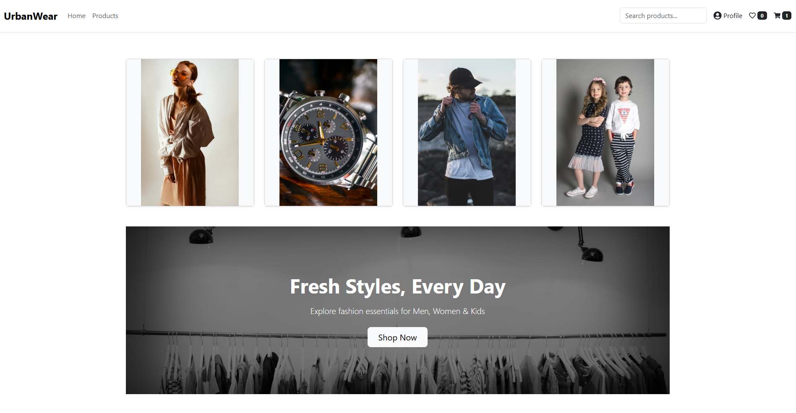
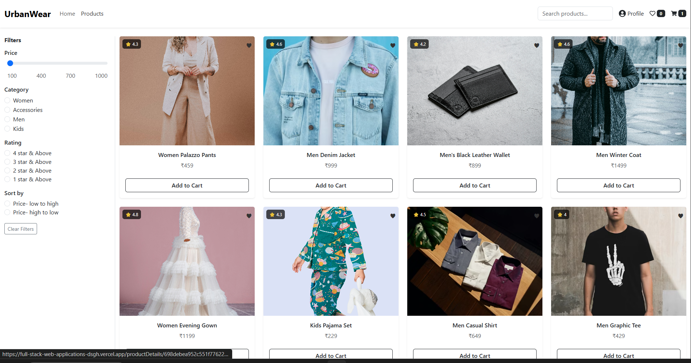
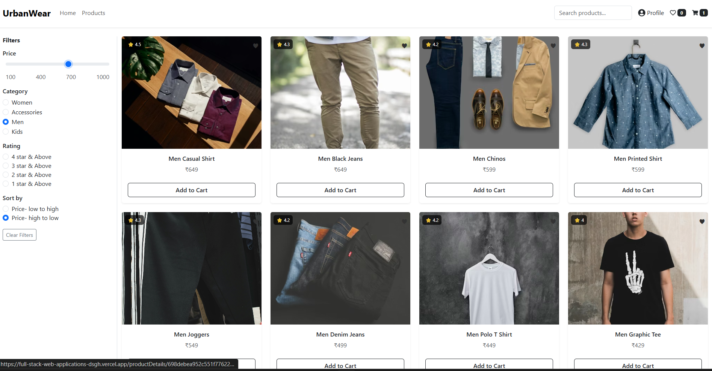
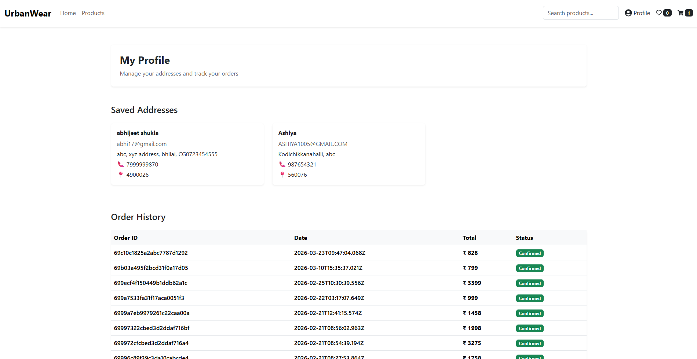
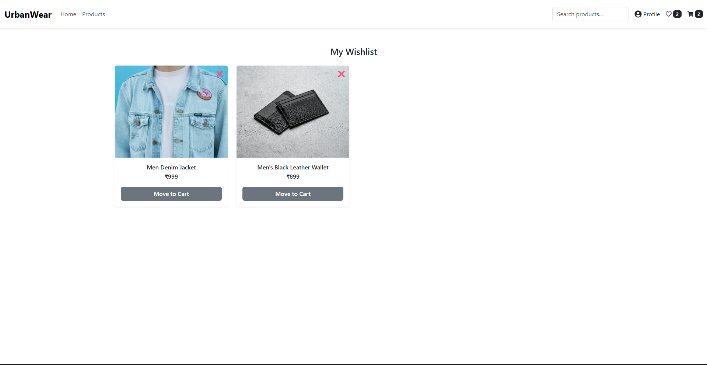
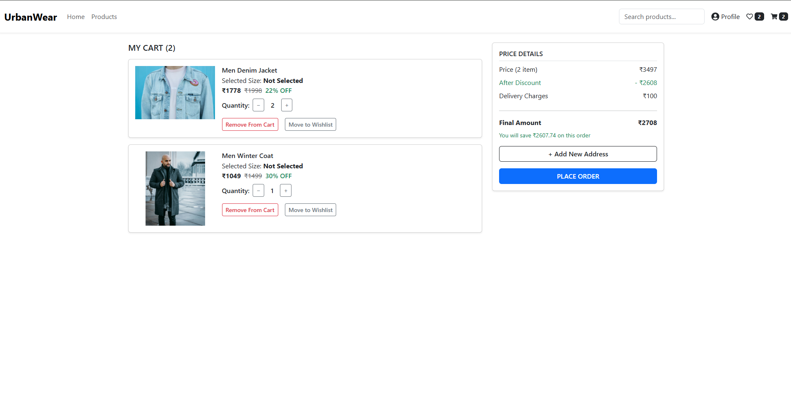
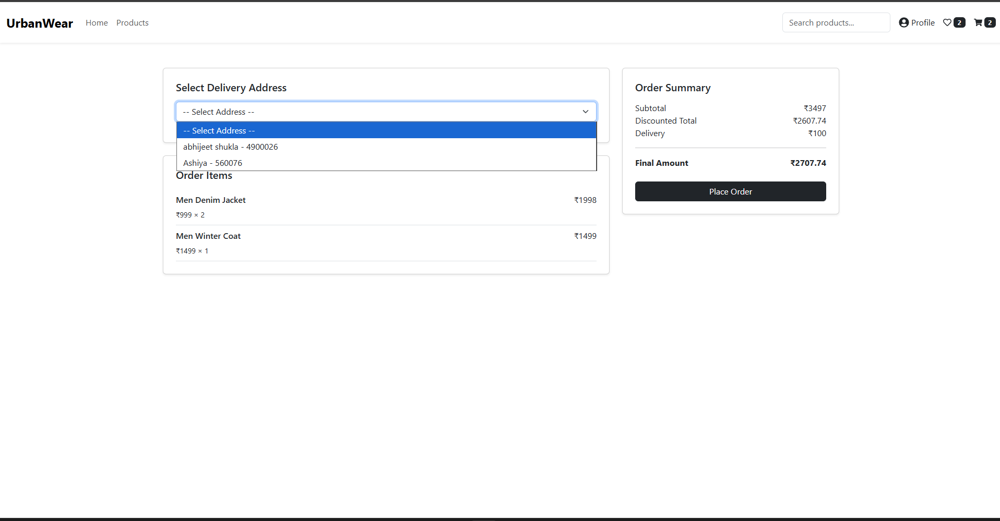
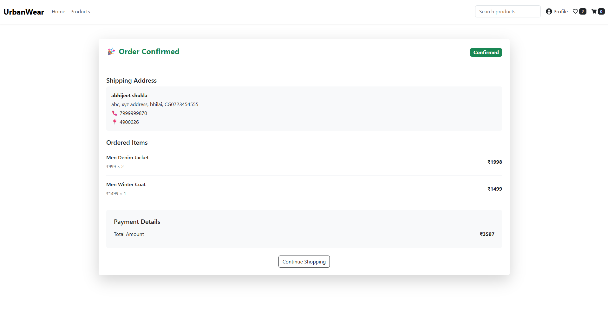

# UrbanWear — Full-Stack E-Commerce Application

A full-stack fashion e-commerce web application built with React (Vite) on the frontend and Node.js + Express on the backend, backed by MongoDB. Supports product browsing by category, wishlist management, cart with persistent storage, address management, and order placement.

---

## Table of Contents

- [Tech Stack](#tech-stack)
- [Project Structure](#project-structure)
- [Features](#features)
- [Data Models](#data-models)
- [API Reference](#api-reference)
  - [Products](#products)
  - [Categories](#categories)
  - [Address](#address)
  - [Orders](#orders)
- [Sample API Responses](#sample-api-responses)
- [Environment Variables](#environment-variables)
- [Getting Started](#getting-started)
  - [Backend](#backend)
  - [Frontend](#frontend)
- [Data Seeding](#data-seeding)
- [Deployment](#deployment)

---

## Tech Stack

**Frontend**

- React 19 + Vite
- React Router DOM v7
- Bootstrap 5
- React Hot Toast
- React Icons

**Backend**

- Node.js + Express 5
- MongoDB + Mongoose 9
- CORS, dotenv

**Deployment**

- Vercel (both frontend and backend)

---

## Project Structure

```
ecommerce/
├── backend/
│   ├── DataSeeder/
│   │   ├── productData.json       # Raw product seed data
│   │   ├── SeedCategories.js      # Seeds Men, Women, Kids, Accessories categories
│   │   └── SeedProducts.js        # Seeds all products from productData.json
│   ├── db/
│   │   └── db.connect.js          # Mongoose connection initializer
│   ├── models/
│   │   ├── address.model.js       # Address schema
│   │   ├── category.model.js      # Category schema
│   │   ├── orders.model.js        # Order schema
│   │   └── product.model.js       # Product schema
│   ├── .env                       # MongoDB URI and PORT
│   ├── index.js                   # Express app — all routes defined here
│   ├── package.json
│   └── vercel.json                # Vercel backend deployment config
│
└── frontend/
    └── my-vite-project/
        ├── public/
        │   └── urbanwear.png      # Brand logo/banner asset
        ├── src/
        │   ├── components/
        │   │   ├── Nav.jsx        # Top navigation bar with search
        │   │   └── CartCounter.jsx # Cart item count badge
        │   ├── contexts/
        │   │   ├── cartContext.jsx      # Global cart state + localStorage sync
        │   │   └── wishlistContext.jsx  # Global wishlist state + localStorage sync
        │   ├── pages/
        │   │   ├── Home.jsx           # Landing page — category grid + hero banner
        │   │   ├── ProductListings.jsx # Products grid with filter/sort/search
        │   │   ├── ProductDetails.jsx  # Single product detail view
        │   │   ├── WishList.jsx        # Saved wishlist items
        │   │   ├── Cart.jsx            # Cart with quantity controls
        │   │   ├── Address.jsx         # Add / edit / delete delivery addresses
        │   │   ├── CheckOut.jsx        # Select address + place order
        │   │   ├── OrderSummary.jsx    # Post-order confirmation screen
        │   │   └── ProfilePage.jsx     # User profile view
        │   ├── App.jsx            # Route definitions + context providers
        │   ├── main.jsx           # React DOM entry point
        │   └── useFetch.jsx       # Generic data-fetching custom hook
        ├── .env                   # VITE_API_URL
        ├── vercel.json            # Vercel SPA rewrite config
        └── vite.config.js
```

---

## Features

- **Category browsing** — Displays Men, Women, Kids, and Accessories on the home page; clicking a category filters the product listing.
- **Product listings** — Fetches all products or products filtered by category; supports search by product name via URL query params.
- **Filter & Sort** — Filters products by minimum rating, maximum price (range slider), and sorts by price (ascending/descending).
- **Product detail page** — Shows full product info including size options, price, discount, and rating, with add-to-cart and add-to-wishlist actions.
- **Cart** — Persists cart items in `localStorage`; supports adding, increasing quantity, decreasing quantity, and removing individual items, as well as clearing the entire cart on order placement.
- **Wishlist** — Persists wishlist in `localStorage`; prevents duplicate entries and supports removal.
- **Address management** — Allows users to create, view, update, and delete delivery addresses stored in MongoDB.
- **Checkout** — Displays saved addresses for selection, calculates total price with discount and delivery charge (₹100 flat), and places the order via the API.
- **Order summary** — Retrieves and displays the most recently placed order including items, shipping address, and total amount.
- **Toast notifications** — Provides real-time user feedback for cart and wishlist actions using React Hot Toast.
- **Skeleton loading states** — Renders placeholder UI while product data is being fetched.

---

## Data Models

### Product

| Field             | Type     | Notes                                        |
| ----------------- | -------- | -------------------------------------------- |
| `productName`     | String   | Required                                     |
| `description`     | String   | Required                                     |
| `productImage`    | String   | URL, required                                |
| `price`           | Number   | Required, range ₹100–₹5000                   |
| `rating`          | Number   | Range 0–5                                    |
| `size`            | [String] | Enum: XS, S, M, L, XL, One Size, 50ml, 100ml |
| `category`        | ObjectId | Ref → Category, required                     |
| `discountedPrice` | Number   | Discount percentage, range 0–50              |

### Category

| Field         | Type   | Notes                       |
| ------------- | ------ | --------------------------- |
| `name`        | String | Unique, required            |
| `slug`        | String | Unique, lowercase, required |
| `categoryURL` | String | Image URL for the category  |

### Address

| Field     | Type   | Notes    |
| --------- | ------ | -------- |
| `name`    | String | Required |
| `email`   | String | Required |
| `address` | String | Required |
| `phone`   | String | Required |
| `pincode` | String | Required |

### Order

| Field         | Type   | Notes                                                                          |
| ------------- | ------ | ------------------------------------------------------------------------------ |
| `items`       | Array  | Each item: productId, productName, price, quantity, selectedSize               |
| `address`     | Object | Snapshot of delivery address at time of order                                  |
| `totalAmount` | Number | Required                                                                       |
| `orderStatus` | String | Enum: Confirmed, Processing, Shipped, Delivered, Cancelled. Default: Confirmed |

---

## API Reference

Base URL (production): `https://full-stack-web-applications-6mlh.vercel.app`

### Products

#### Get all products

```
GET /api/products
```

Returns an array of all products with their category references.

#### Get product by ID

```
GET /api/products/:productId
```

Returns a single product document matching the given `productId`.

#### Get products by category

```
GET /api/products/categories/:categoryId
```

Returns all products that belong to the specified `categoryId`.

---

### Categories

#### Get all categories

```
GET /api/categories
```

Returns an array of all available categories (Men, Women, Kids, Accessories).

#### Get category by ID

```
GET /api/categories/:categoryId
```

Returns a single category document matching the given `categoryId`.

---

### Address

#### Get all addresses

```
GET /api/address
```

Returns an array of all saved delivery addresses.

#### Get address by ID

```
GET /api/address/:addressId
```

Returns a single address document matching the given `addressId`.

#### Create a new address

```
POST /api/address
Content-Type: application/json
```

Saves a new delivery address to the database and returns a success message.

**Request body:**

```json
{
  "name": "John Doe",
  "email": "john@example.com",
  "address": "123 Main Street, Bengaluru",
  "phone": "9876543210",
  "pincode": "560001"
}
```

#### Update address by ID

```
PUT /api/address/:addressId
Content-Type: application/json
```

Updates an existing address by its ID and returns the updated document.

#### Delete address by ID

```
DELETE /api/address/:addressId
```

Removes an address from the database and confirms deletion.

---

### Orders

#### Get all orders

```
GET /api/orders
```

Returns all orders sorted by creation date descending (newest first).

#### Place a new order

```
POST /api/orders
Content-Type: application/json
```

Creates a new order record with the provided cart items, delivery address, and total amount.

**Request body:**

```json
{
  "items": [
    {
      "productId": "<product_id>",
      "productName": "Classic White Tee",
      "price": "799",
      "quantity": "2",
      "selectedsize": "M"
    }
  ],
  "address": {
    "name": "John Doe",
    "email": "john@example.com",
    "address": "123 Main Street, Bengaluru",
    "phone": "9876543210",
    "pincode": "560001"
  },
  "totalAmount": 1698,
  "orderStatus": "Confirmed"
}
```

---

## Sample API Responses

### `GET /api/product`

```
[{    "_id": "698debea952c551f7762287d",
    "productName": "Women Palazzo Pants",
    "description": "Flowy palazzo pants with elastic waistband and elegant drape.",
    "productImage": "/images/women-plazzo-pants.jpg",
    "price": 459,
    "rating": 4.3,
    "size": [
      "S",
      "M",
      "L"
    ],
    "category": "698c90379cc3bc35dd0ab58d",
    "discountedPrice": 14,
    "__v": 0,
    "createdAt": "2026-02-12T15:04:10.435Z",
    "updatedAt": "2026-02-12T15:04:10.435Z"
  },
  {
    "_id": "698debea952c551f7762288d",
    "productName": "Men Denim Jacket",
    "description": "Classic denim jacket with rugged style.",
    "productImage": "https://images.unsplash.com/photo-1495105787522-5334e3ffa0ef?w=400&auto=format&fit=crop",
    "price": 999,
    "rating": 4.6,
    "size": [
      "M",
      "L",
      "XL"
    ],
    "category": "698c90379cc3bc35dd0ab58c",
    "discountedPrice": 22,
    "__v": 0,
    "createdAt": "2026-02-12T15:04:10.436Z",
    "updatedAt": "2026-02-12T15:04:10.436Z"
  },]
```

### `GET /api/categories`

```
[
  {
    "_id": "698c90379cc3bc35dd0ab58d",
    "name": "Women",
    "slug": "women",
    "categoryURL": "https://images.pexels.com/photos/1926769/pexels-photo-1926769.jpeg?auto=compress&cs=tinysrgb&w=600&h=900&fit=crop",
    "__v": 0,
    "createdAt": "2026-02-11T14:20:39.386Z",
    "updatedAt": "2026-02-11T14:20:39.386Z"
  },
  {
    "_id": "698c90379cc3bc35dd0ab58f",
    "name": "Accessories",
    "slug": "accessories",
    "categoryURL": "https://images.pexels.com/photos/190819/pexels-photo-190819.jpeg?auto=compress&cs=tinysrgb&w=600&h=900&fit=crop",
    "__v": 0,
    "createdAt": "2026-02-11T14:20:39.386Z",
    "updatedAt": "2026-02-11T14:20:39.386Z"
  },
  {
    "_id": "698c90379cc3bc35dd0ab58c",
    "name": "Men",
    "slug": "men",
    "categoryURL": "https://images.pexels.com/photos/1040945/pexels-photo-1040945.jpeg?auto=compress&cs=tinysrgb&w=600&h=900&fit=crop",
    "__v": 0,
    "createdAt": "2026-02-11T14:20:39.385Z",
    "updatedAt": "2026-02-11T14:20:39.385Z"
  },
  {
    "_id": "698c90379cc3bc35dd0ab58e",
    "name": "Kids",
    "slug": "kids",
    "categoryURL": "https://images.pexels.com/photos/1620760/pexels-photo-1620760.jpeg?auto=compress&cs=tinysrgb&w=600&h=900&fit=crop",
    "__v": 0,
    "createdAt": "2026-02-11T14:20:39.386Z",
    "updatedAt": "2026-02-11T14:20:39.386Z"
  }
]
```

### `GET /api/address`

```json
[
  {
    "_id": "69900ac6188d39dbde331484",
    "name": "abhijeet shukla",
    "email": "abhi17@gmail.com",
    "address": "abc, xyz address, bhilai, CG0723454555",
    "phone": "7999999870",
    "pincode": "4900026",
    "createdAt": "2026-02-14T05:40:22.191Z",
    "updatedAt": "2026-02-21T05:26:05.851Z",
    "__v": 0
  },
  {
    "_id": "6992cb9ad551f2cb9b44e728",
    "name": "Ashiya ",
    "email": "ASHIYA1005@GMAIL.COM",
    "address": "Kodichikkanahalli, abc",
    "phone": "987654321",
    "pincode": "560076",
    "createdAt": "2026-02-16T07:47:38.771Z",
    "updatedAt": "2026-02-22T03:16:42.143Z",
    "__v": 0
  }
] // Add sample response here
```

### `GET /api/orders`

```json
[
  {
    "address": {
      "name": "Ashiya ",
      "email": "ASHIYA1005@GMAIL.COM",
      "address": "Kodichikkanahalli, abc",
      "phone": "987654321",
      "pincode": "560076"
    },
    "_id": "69c10c1825a2abc7787d1292",
    "items": [
      {
        "productName": "Kids Casual Shirt",
        "price": "279",
        "quantity": "1",
        "_id": "698debea952c551f77622863"
      },
      {
        "productName": "Men Polo T Shirt",
        "price": "449",
        "quantity": "1",
        "_id": "698debea952c551f7762286d"
      }
    ],
    "totalAmount": 828,
    "orderStatus": "Confirmed",
    "createdAt": "2026-03-23T09:47:04.068Z",
    "updatedAt": "2026-03-23T09:47:04.068Z",
    "__v": 0
  }
]
```

---

## Environment Variables

### Backend (`backend/.env`)

| Variable      | Description                       |
| ------------- | --------------------------------- |
| `MONGODB_URI` | MongoDB Atlas connection string   |
| `PORT`        | Port for local development (3000) |

### Frontend (`frontend/my-vite-project/.env`)

| Variable       | Description                          |
| -------------- | ------------------------------------ |
| `VITE_API_URL` | Base URL of the deployed backend API |

---

## Getting Started

### Backend

```bash
cd ecommerce/backend
npm install
```

Create a `.env` file:

```
MONGODB_URI=your_mongodb_atlas_connection_string
PORT=3000
```

Start the server:

```bash
npm run dev
```

The API will be available at `http://localhost:3000`.

---

### Frontend

```bash
cd ecommerce/frontend/my-vite-project
npm install
```

Create a `.env` file:

```
VITE_API_URL=http://localhost:3000
```

Start the dev server:

```bash
npm run dev
```

The app will be available at `http://localhost:5173`.

---

## Data Seeding

Seeds are located in `backend/DataSeeder/`. Run them once after the backend is connected to MongoDB to populate the database.

**Seed categories** (Men, Women, Kids, Accessories):

```bash
cd backend
node DataSeeder/SeedCategories.js
```

**Seed products** (reads from `productData.json`):

```bash
cd backend
node DataSeeder/SeedProducts.js
```

> Note: Both seeders delete existing records before inserting fresh data. Run `SeedCategories.js` before `SeedProducts.js` so that category ObjectIds exist when products are inserted.

---

## Deployment

Both the frontend and backend are deployed on **Vercel**.

**Backend** — `backend/vercel.json` routes all traffic to `index.js` using `@vercel/node`.

**Frontend** — `frontend/my-vite-project/vercel.json` rewrites all routes to `/` so that React Router handles client-side navigation correctly.

Live backend URL: `https://full-stack-web-applications-6mlh.vercel.app`

---

## App Screenshots









