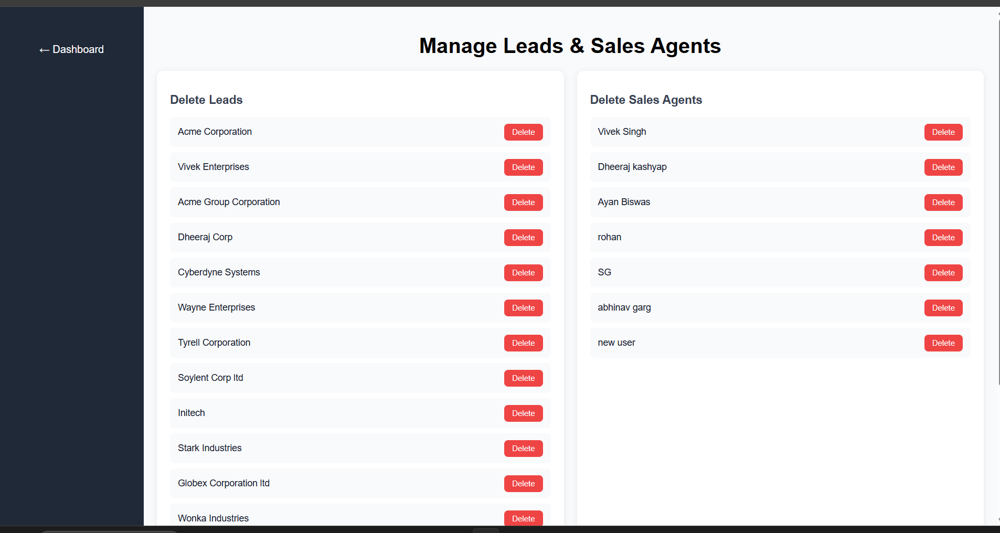
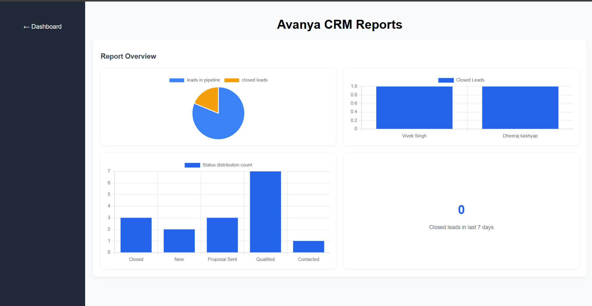
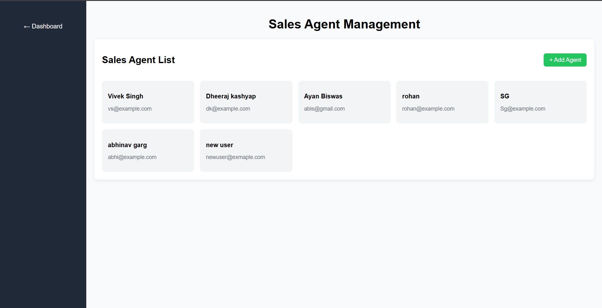
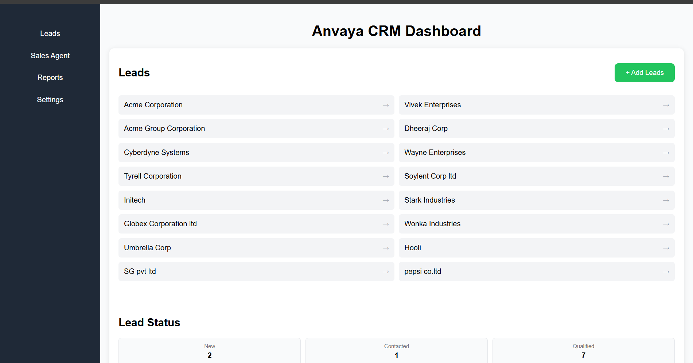

# Anvaya CRM

A full-stack Customer Relationship Management (CRM) web application to manage leads, sales agents, activity logs, and reports — built with React, Node.js, Express, and MongoDB.

---

## 🔗 Live Demo

|                 | URL                                                           |
| --------------- | ------------------------------------------------------------- |
| **Frontend**    | https://full-stack-web-applications-ubvg.vercel.app           |
| **Backend API** | https://full-stack-web-applications-k8m1.vercel.app/api/leads |

---

## ✨ Features

- **Manage Leads** — Create, view, edit, and delete leads with status tracking through a full sales pipeline
- **Sales Pipeline** — Track leads across 5 stages: `New → Contacted → Qualified → Proposal Sent → Closed`
- **Lead's Filtering & Sorting** — Filter by status, source, and sales agent; sort by priority and time to close
- **Manage Sales Agent** — Add and remove agents with unique email validation
- **Activity Comments** — Log comments on individual leads, linked to an agent author
- **Reports & Charts** — Visual reports with pie and bar charts powered by Chart.js
- **Responsive UI** — Mobile-friendly layout with a slide-in sidebar navigation

---

## 📸 Screenshots

> Dashboard | Lead List | Reports









---

## 🛠️ Tech Stack

**Frontend**

- React 19 + Vite
- React Router DOM v7
- Chart.js + react-chartjs-2
- Plain CSS with responsive design

**Backend**

- Node.js + Express v5
- MongoDB + Mongoose
- REST API with input validation

**Deployment**

- Vercel (frontend + backend, deployed separately)

---

## 📁 Project Structure

```
crm-app/
├── frontend/                   # React app (Vite)
│   └── src/
│       ├── pages/
│       │   ├── Home/           # Dashboard
│       │   ├── Leads/          # Lead list, management, add, edit
│       │   ├── SalesAgents/    # Agent list and management
│       │   └── Reports/        # Charts and report views
│       ├── App.jsx             # Routes
│       ├── main.jsx            # Entry point
│       └── useFetch.jsx        # Custom data fetching hook
│
└── backend/                    # Express API
    ├── models/
    │   ├── Lead.model.js
    │   ├── SalesAgent.model.js
    │   ├── Comment.model.js
    │   └── Tags.model.js
    ├── SeedData/               # DB seed scripts
    ├── DB/db.connect.js        # MongoDB connection
    └── index.js                # All routes
```

---

## 🚀 Getting Started

### Prerequisites

- Node.js v18+
- MongoDB connection string (MongoDB Atlas or local)

### 1. Clone the repo

```bash
git clone https://github.com/vivek1702/Full-Stack-web-Applications.git
cd Full-Stack-web-Applications/crm-app
```

### 2. Setup Backend

```bash
cd backend
npm install
```

Create a `.env` file in the `backend/` folder:

```env
MONGODB_URI=your_mongodb_connection_string
PORT=5000
```

Start the backend:

```bash
npm run dev
```

### 3. Setup Frontend

```bash
cd frontend
npm install
```

Create a `.env` file in the `frontend/` folder:

```env
VITE_API_BASE_URL=http://localhost:5000
```

Start the frontend:

```bash
npm run dev
```

Open `http://localhost:5173` in your browser.

---

## 📡 API Reference

Base URL: `https://full-stack-web-applications-k8m1.vercel.app`

### Leads

| Method   | Endpoint         | Description                                                               |
| -------- | ---------------- | ------------------------------------------------------------------------- |
| `GET`    | `/api/leads`     | Get all leads. Filter by `?status=`, `?source=`, `?salesAgent=`, `?tags=` |
| `POST`   | `/api/leads`     | Create a new lead                                                         |
| `PUT`    | `/api/leads/:id` | Update a lead                                                             |
| `DELETE` | `/api/leads/:id` | Delete a lead                                                             |

### Agents

| Method   | Endpoint          | Description          |
| -------- | ----------------- | -------------------- |
| `GET`    | `/api/agents`     | Get all sales agents |
| `POST`   | `/api/agents`     | Create a new agent   |
| `DELETE` | `/api/agents/:id` | Delete an agent      |

### Comments

| Method | Endpoint                  | Description                 |
| ------ | ------------------------- | --------------------------- |
| `GET`  | `/api/leads/:id/comments` | Get all comments for a lead |
| `POST` | `/api/leads/:id/comments` | Add a comment to a lead     |

### Reports

| Method | Endpoint                               | Description                          |
| ------ | -------------------------------------- | ------------------------------------ |
| `GET`  | `/api/report/last-week`                | Leads closed in the last 7 days      |
| `GET`  | `/api/report/pipeline`                 | Count of leads currently in pipeline |
| `GET`  | `/api/report/closed`                   | All closed leads + count             |
| `GET`  | `/api/report/agent-closed-leads`       | Closed leads grouped by agent        |
| `GET`  | `/api/report/leadsStatus-distrubition` | Lead count per status                |

### Tags

| Method | Endpoint    | Description      |
| ------ | ----------- | ---------------- |
| `GET`  | `/api/tags` | Get all tags     |
| `POST` | `/api/tags` | Create a new tag |

---

## Sample API Responses

get/api/leads

```
[
  {
    "_id": "69bc2ddfa4a1929390e14dcc",
    "name": "Acme Corporation",
    "source": "Referral",
    "salesAgent": "69bc0632625dfd6a9e3c0251",
    "status": "Closed",
    "tags": [
      "High Value",
      "Follow-up"
    ],
    "timeToClose": 10,
    "priority": "Medium",
    "createdAt": "2026-03-19T17:09:51.018Z",
    "updatedAt": "2026-04-02T13:16:20.518Z",
    "__v": 0,
    "closedAt": "2026-04-02T13:21:32.975Z"
  },
  {
    "_id": "69be626924e03f631686edd2",
    "name": "Vivek Enterprises",
    "source": "Website",
    "salesAgent": "69c8b32593cd311282f46edb",
    "status": "Qualified",
    "tags": [
      "High Value",
      "Follow-up"
    ],
    "timeToClose": 20,
    "priority": "Medium",
    "createdAt": "2026-03-21T09:18:33.445Z",
    "updatedAt": "2026-04-08T06:30:19.212Z",
    "__v": 0
  },]
```

get/api/agents

```
[
  {
    "_id": "69beafbd5876fe0dbd2dbf1a",
    "name": "Vivek Singh",
    "email": "vs@example.com",
    "createdAt": "2026-03-21T14:48:29.103Z",
    "__v": 0
  },
  {
    "_id": "69beb68397652372feeac39a",
    "name": "Dheeraj kashyap",
    "email": "dk@example.com",
    "createdAt": "2026-03-21T15:17:23.424Z",
    "__v": 0
  },
  {
    "_id": "69c11dc001cedc61eef7e391",
    "name": "Ayan Biswas",
    "email": "abis@gmail.com",
    "createdAt": "2026-03-23T11:02:24.198Z",
    "__v": 0
  },]
```

api/report/pipeline

```
{
  "totalLeadsInPipeline": 13
}
```

api/report/closed

```
{
  "totalLeadsClosed": 3,
  "totalLeads": [
    {
      "_id": "69bc2ddfa4a1929390e14dcc",
      "name": "Acme Corporation",
      "source": "Referral",
      "salesAgent": "69bc0632625dfd6a9e3c0251",
      "status": "Closed",
      "tags": [
        "High Value",
        "Follow-up"
      ],
      "timeToClose": 10,
      "priority": "Medium",
      "createdAt": "2026-03-19T17:09:51.018Z",
      "updatedAt": "2026-04-02T13:16:20.518Z",
      "__v": 0,
      "closedAt": "2026-04-02T13:21:32.975Z"
    },
    {
      "_id": "69c121682b3726a6ecc0f061",
      "name": "Cyberdyne Systems",
      "source": "Advertisement",
      "salesAgent": "69beb68397652372feeac39a",
      "status": "Closed",
      "tags": [
        "Tech",
        "Strategic"
      ],
      "timeToClose": 12,
      "priority": "High",
      "createdAt": "2026-03-23T11:18:00.875Z",
      "updatedAt": "2026-03-23T11:18:00.875Z",
      "__v": 0,
      "closedAt": "2026-03-30T13:39:14.146Z"
    },
    {
      "_id": "69c121682b3726a6ecc0f05c",
      "name": "Hooli",
      "source": "Email",
      "salesAgent": "69beafbd5876fe0dbd2dbf1a",
      "status": "Closed",
      "tags": [
        "Enterprise",
        "Repeat Client"
      ],
      "timeToClose": 10,
      "priority": "High",
      "createdAt": "2026-03-23T11:18:00.874Z",
      "updatedAt": "2026-03-23T11:18:00.874Z",
      "__v": 0
    }
  ]
}
```

## 🗃️ Data Models

### Lead

```js
{
  name: String,           // required
  source: String,         // enum: Website, Referral, Cold Call, Advertisement, Email, Other
  salesAgent: ObjectId,   // ref: SalesAgent
  status: String,         // enum: New, Contacted, Qualified, Proposal Sent, Closed
  tags: [String],
  timeToClose: Number,    // days (positive integer)
  priority: String,       // enum: High, Medium, Low
  createdAt: Date,
  updatedAt: Date,
  closedAt: Date
}
```

### SalesAgent

```js
{
  name: String,     // required
  email: String,    // required, unique
  createdAt: Date
}
```

### Comment

```js
{
  lead: ObjectId,         // ref: Lead
  author: ObjectId,       // ref: SalesAgent
  commentText: String,    // required
  createdAt: Date
}
```

---

## 📄 License

MIT
