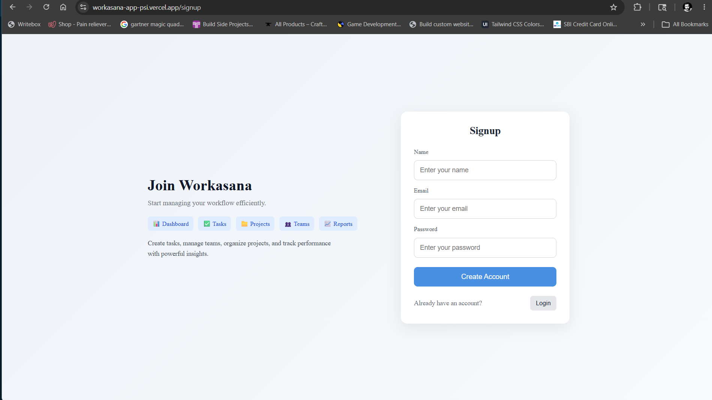
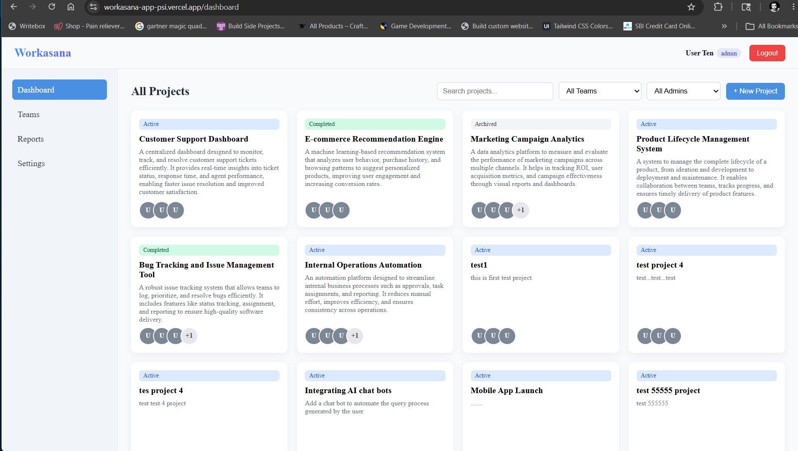
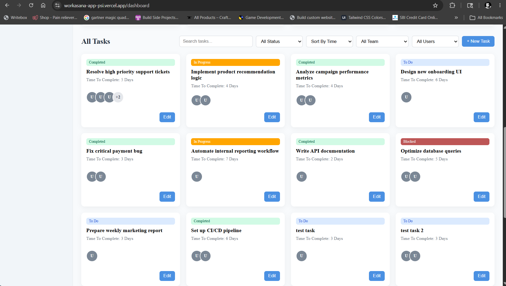
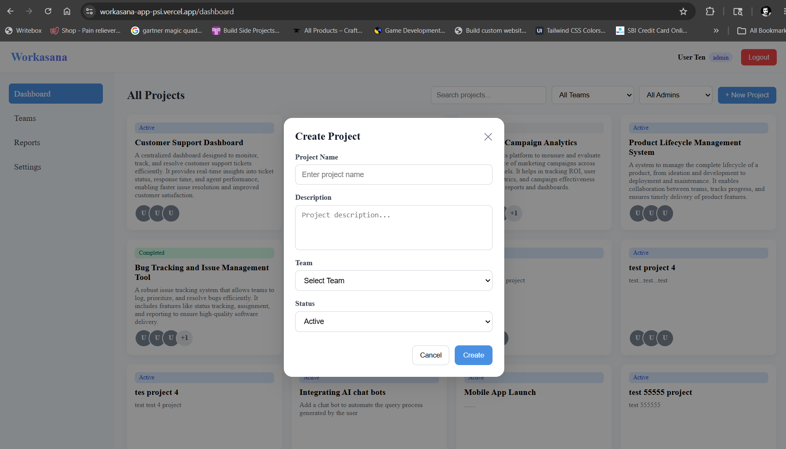
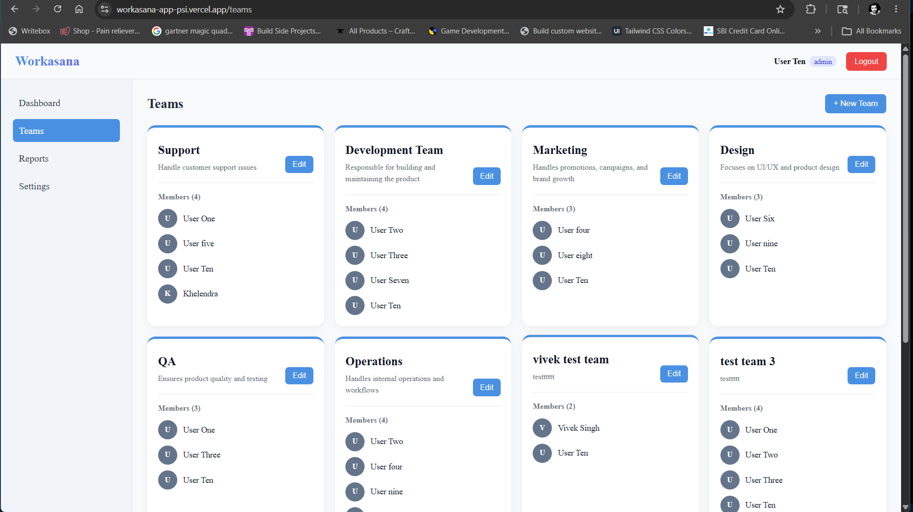
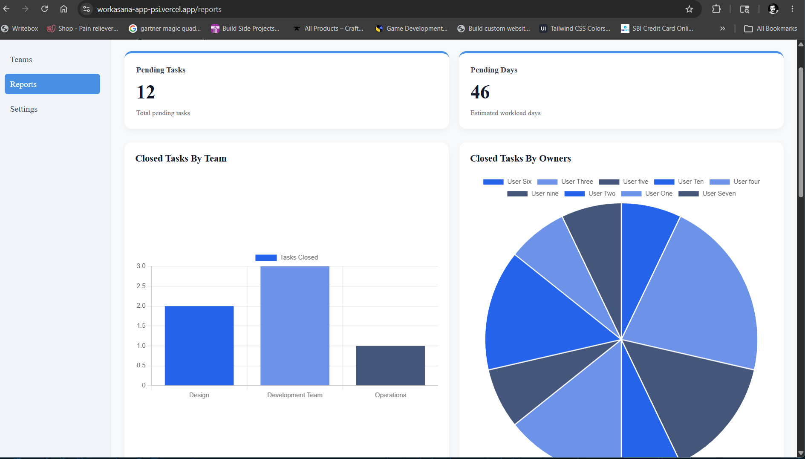
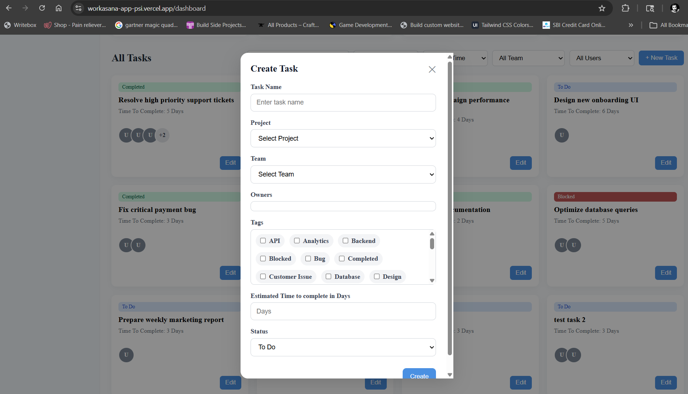

# Workasana — Task & Project Management App

A full-stack task and project management web application built for teams. Workasana lets organizations create teams, assign projects, manage tasks, and track performance through a reporting dashboard — all with role-based access control baked in at every layer.

📄[https://app.notion.com/p/PRD-for-Workasana-app-36c177e2738f80d0b4b3c73f8e9667a5?source=copy_link]()

---

## Live Demo

🔗 **Frontend:** https://workasana-app-psi.vercel.app/

🔗 **Backend API:** https://full-stack-web-applications-fy35.onrender.com

**Demo Credentials:**

| Role  | Email                      | Password        |
| ----- | -------------------------- | --------------- |
| Admin | user10@example.com         | @abc1234        |
| User  | You can sign-up then login | `YOUR_PASSWORD` |

---

## Screenshots

### Login & Signup

<!-- Add screenshot here -->




### Dashboard — Projects & Tasks

<!-- Add screenshot here -->







### Teams

<!-- Add screenshot here -->



### Reports & Analytics

<!-- Add screenshot here -->



### Settings — Task Management



---

## Features

- **Authentication** — JWT-based signup/login with bcrypt password hashing and 24-hour token expiry
- **Role-Based Access Control** — Two roles (`admin` / `user`) with different data visibility and action permissions enforced at the API level
- **Projects** — Create and filter projects by team, status, or creator; scoped to your teams if you're a regular user
- **Tasks** — Create, edit, and delete tasks with owners, tags, estimated days, and status tracking
- **Teams** — Admin-managed team creation and membership; users see only their own teams
- **Reports & Analytics** — Charts for closed tasks by team, by owner, and by project; pending workload summary; last-week completion view
- **Settings** — Task list with delete controls and a total task count stat

---

## Role-Based Access Control

Workasana has two roles — `admin` and `user`. The role is embedded in the JWT at login and checked on every protected API route.

| Resource                             | Admin         | User                              |
| ------------------------------------ | ------------- | --------------------------------- |
| View users                           | All users     | Only teammates                    |
| Create team                          | ✅            | ❌                                |
| View teams                           | All teams     | Only their teams                  |
| Edit team                            | ✅            | ❌                                |
| Create project                       | ✅            | ❌                                |
| View projects                        | All projects  | Created by them or in their teams |
| Create task                          | ✅            | ✅                                |
| View tasks                           | All tasks     | Tasks they own or team tasks      |
| Edit task (name, status, tags, time) | ✅            | ✅ (if owner)                     |
| Edit task (owners, team, project)    | ✅            | ❌                                |
| Delete task                          | ✅            | ✅ (if owner)                     |
| View reports                         | Full org data | Scoped to their teams             |

---

## Tech Stack

| Layer            | Technology                           |
| ---------------- | ------------------------------------ |
| Frontend         | React 18 + Vite                      |
| Routing          | React Router v6                      |
| State Management | React Context API                    |
| Charts           | Chart.js + react-chartjs-2           |
| Notifications    | react-hot-toast                      |
| Backend          | Node.js + Express                    |
| Database         | MongoDB + Mongoose                   |
| Authentication   | JWT + bcrypt                         |
| Deployment       | Vercel (frontend) · Render (backend) |

---

## Project Structure

```
workasana-app/
├── backend/
│   ├── db/
│   │   └── db.connect.js
│   ├── models/
│   │   ├── User.model.js
│   │   ├── Team.model.js
│   │   ├── Project.model.js
│   │   ├── Task.model.js
│   │   └── Tag.model.js
│   ├── SeedDataToDb/
│   │   ├── seedUser.js
│   │   ├── seedTeam.js
│   │   ├── seedProject.js
│   │   ├── seedTask.js
│   │   └── seedTags.js
│   ├── index.js
│   └── package.json
│
└── frontend/my-app/
    ├── src/
    │   ├── components/
    │   │   ├── Navbar.jsx
    │   │   ├── Layout.jsx
    │   │   └── ProtectedRoutes.jsx
    │   ├── context/
    │   │   └── AuthorizationContext.jsx
    │   ├── hooks/
    │   │   ├── UseFetch.jsx
    │   │   ├── UseTasks.jsx
    │   │   ├── UseProject.jsx
    │   │   └── UseTeams.jsx
    │   ├── pages/
    │   │   ├── Login.jsx
    │   │   ├── Signup.jsx
    │   │   ├── Dashboard.jsx
    │   │   ├── Teams.jsx
    │   │   ├── Reports.jsx
    │   │   ├── Settings.jsx
    │   │   ├── CreateProjectModal.jsx
    │   │   ├── CreateTaskModal.jsx
    │   │   ├── CreateTeamModal.jsx
    │   │   ├── EditTaskModal.jsx
    │   │   └── EditTeamModal.jsx
    │   └── App.jsx
    └── package.json
```

---

## API Reference

All routes except auth are protected and require `Authorization: Bearer <token>` in the request header.

### Auth

| Method | Endpoint           | Description           |
| ------ | ------------------ | --------------------- |
| POST   | `/api/auth/signup` | Register a new user   |
| POST   | `/api/auth/login`  | Login and receive JWT |
| GET    | `/api/auth/me`     | Get current user info |

### Users

| Method | Endpoint      | Description    | Access                            |
| ------ | ------------- | -------------- | --------------------------------- |
| GET    | `/api/users`  | Get users      | Admin: all · User: teammates only |
| GET    | `/api/admins` | Get all admins | All authenticated                 |

### Teams

| Method | Endpoint         | Description    | Access                       |
| ------ | ---------------- | -------------- | ---------------------------- |
| POST   | `/api/teams`     | Create a team  | Admin only                   |
| GET    | `/api/teams`     | Get teams      | Admin: all · User: own teams |
| GET    | `/api/teams/:id` | Get team by ID | Admin only                   |
| PUT    | `/api/teams/:id` | Update a team  | Admin only                   |

### Projects

| Method | Endpoint        | Description      | Access                    |
| ------ | --------------- | ---------------- | ------------------------- |
| POST   | `/api/projects` | Create a project | All authenticated         |
| GET    | `/api/projects` | Get projects     | Admin: all · User: scoped |

### Tasks

| Method | Endpoint        | Description              | Access                                        |
| ------ | --------------- | ------------------------ | --------------------------------------------- |
| POST   | `/api/task`     | Create a task            | All authenticated                             |
| GET    | `/api/task`     | Get tasks (with filters) | Admin: all · User: scoped                     |
| GET    | `/api/task/:id` | Get task by ID           | Admin: any · User: own tasks                  |
| PUT    | `/api/task/:id` | Update a task            | Admin: all fields · User: content fields only |
| DELETE | `/api/task/:id` | Delete a task            | Admin: any · User: own tasks                  |

**Task query params:** `search`, `projectId`, `team`, `owners`, `tags`, `status`, `sortBy`, `order`

### Tags

| Method | Endpoint    | Description  |
| ------ | ----------- | ------------ |
| POST   | `/api/tags` | Create a tag |
| GET    | `/api/tags` | Get all tags |

### Reports

| Method | Endpoint                        | Description                             |
| ------ | ------------------------------- | --------------------------------------- |
| GET    | `/api/report/last-week`         | Completed tasks in last 7 days          |
| GET    | `/api/report/pending`           | Total pending tasks and workload days   |
| GET    | `/api/report/closed-by-team`    | Completed task count grouped by team    |
| GET    | `/api/report/closed-by-owners`  | Completed task count grouped by owner   |
| GET    | `/api/report/closed-by-project` | Completed task count grouped by project |

---

## Getting Started

### Prerequisites

- Node.js v18+
- MongoDB connection string

### Backend Setup

```bash
cd backend
npm install
```

Create a `.env` file in `/backend`:

```
MONGO_URI=your_mongodb_connection_string
JWT_SECRET=your_jwt_secret
PORT=3000
```

```bash
node index.js
```

To seed the database:

```bash
node SeedDataToDb/seedUser.js
node SeedDataToDb/seedTeam.js
node SeedDataToDb/seedProject.js
node SeedDataToDb/seedTags.js
node SeedDataToDb/seedTask.js
```

### Frontend Setup

```bash
cd frontend/my-app
npm install
npm run dev
```

---

## Author

**Vivek Singh**

[GitHub](https://github.com/vivek1702) · [LinkedIn](https://claude.ai/chat/YOUR_LINKEDIN_LINK_HERE)
